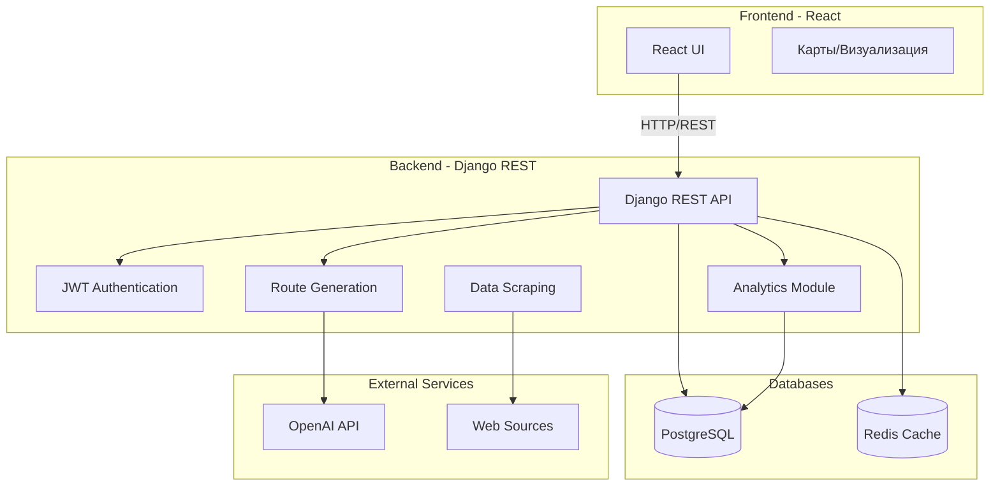

# План реализации веб-сервиса планирования туристических маршрутов Казани

## Архитектура системы




## Структура проекта

```javascript
tourist-routes-service/
├── backend/                    # Django проект
│   ├── config/                # Настройки Django
│   ├── accounts/              # Модуль аутентификации
│   ├── routes/                # Модуль маршрутов
│   ├── attractions/           # Модуль достопримечательностей
│   ├── scraper/               # Модуль парсинга данных
│   ├── analytics/             # Модуль аналитики
│   ├── api/                   # API endpoints
│   └── utils/                 # Утилиты
├── frontend/                  # React приложение
│   ├── src/
│   │   ├── components/
│   │   ├── pages/
│   │   ├── services/
│   │   └── utils/
│   └── public/
├── docker-compose.yml
├── Dockerfile.backend
├── Dockerfile.frontend
├── requirements.txt
└── README.md
```


## Основные компоненты

### 1. Backend (Django REST Framework)

#### Модели данных (`backend/routes/models.py`, `backend/attractions/models.py`)

- **User** (расширение Django User)
- **Attraction** (достопримечательности: название, описание, координаты, категория, рейтинг)
- **Route** (маршруты: название, описание, пользователь, достопримечательности, длительность, бюджет)
- **RouteAttraction** (связь маршрута с достопримечательностями + порядок)
- **UserPreference** (предпочтения пользователя для персонализации)

#### API Endpoints (`backend/api/`)

- `POST /api/auth/register/` - регистрация
- `POST /api/auth/login/` - вход (JWT)
- `POST /api/auth/refresh/` - обновление токена
- `GET /api/attractions/` - список достопримечательностей
- `POST /api/routes/generate/` - генерация маршрута (LLM)
- `GET /api/routes/` - список маршрутов пользователя
- `GET /api/routes/{id}/` - детали маршрута
- `POST /api/routes/{id}/optimize/` - оптимизация маршрута
- `GET /api/analytics/popular/` - популярные маршруты
- `GET /api/analytics/stats/` - статистика

#### Генерация маршрутов (`backend/routes/generators.py`)

- **LLM Generator**: интеграция с OpenAI API для создания описательных маршрутов
- **Algorithmic Generator**: генерация на основе фильтров (интересы, время, бюджет)
- **Hybrid Generator**: комбинация LLM + алгоритмической оптимизации

#### Парсинг данных (`backend/scraper/`)

- Модуль для парсинга информации о достопримечательностях Казани
- Использование BeautifulSoup4 и Selenium для динамических страниц
- Периодическое обновление данных (Celery tasks)

#### Аналитика (`backend/analytics/`)

- Статистика популярности маршрутов
- Визуализации с matplotlib/seaborn (генерация графиков)
- Экспорт данных в pandas для анализа

### 2. Frontend (React)

#### Основные страницы

- Главная страница с поиском и фильтрами
- Страница маршрута с картой и описанием
- Личный кабинет пользователя
- Страница создания/редактирования маршрута
- Страница аналитики (графики)

#### Компоненты

- Карта (интеграция с Yandex Maps/Leaflet)
- Фильтры маршрутов
- Визуализация маршрута на карте
- Графики аналитики

### 3. Базы данных

#### PostgreSQL

- Основные таблицы: пользователи, маршруты, достопримечательности
- Индексы для оптимизации запросов
- Миграции Django

#### Redis

- Кэширование популярных маршрутов
- Хранение сессий (опционально)
- Кэш для LLM запросов

### 4. Docker & Deployment

#### Docker Compose конфигурация

- Сервис PostgreSQL
- Сервис Redis
- Сервис Django (backend)
- Сервис React (frontend, nginx)
- Volumes для данных БД

### 5. Тестирование

#### Unit-тесты

- Тесты моделей
- Тесты API endpoints
- Тесты генераторов маршрутов
- Тесты парсера
- Покрытие > 70%

## Варианты генерации маршрутов

1. **LLM-генерация (OpenAI)**

- Промпт с описанием предпочтений пользователя
- Генерация текстового описания маршрута
- Извлечение достопримечательностей из ответа

2. **Алгоритмическая генерация**

- Фильтрация по категориям интересов
- Оптимизация по времени/расстоянию
- Учет бюджета

3. **Гибридный подход**

- LLM генерирует концепцию маршрута
- Алгоритм оптимизирует порядок посещения
- Учет реальных координат и времени

4. **Рекомендательная система (scikit-learn)**

- Анализ предпочтений пользователя
- Collaborative filtering
- Персонализированные рекомендации

## Технологический стек

**Backend:**

- Django 4.2+
- Django REST Framework
- djangorestframework-simplejwt (JWT)
- psycopg2 (PostgreSQL)
- redis-py
- openai (LLM)
- beautifulsoup4, selenium (парсинг)
- pandas, scikit-learn (аналитика)
- matplotlib, seaborn (визуализации)
- celery (фоновые задачи)

**Frontend:**

- React 18+
- React Router
- Axios